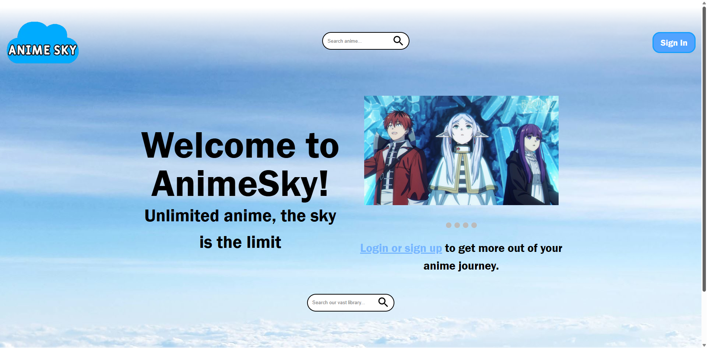

# Anime Streaming Site Landing Page Demo - AnimeSky

This is a demo for a landing page of an anime strteaming site. Because it's intially intended to be just a demo, no functionality for watching anime or creating an account to log in, but I may add those features later if I decide to expand on this project. For now, it's just the front end of a landing page. I made this because I wanted to get practice and experience making a landing page.

Live Demo: https://anime-streaming-site-landing-page-d.vercel.app/ 

---

## Table of Contents

- [Overview](#overview)
- [Features](#features)
- [Tech Stack](#tech-stack)
- [Screenshots](#screenshots)
- [Deployment](#deployment)
- [Future Improvements](#future-improvements)
- [Credits](#credits)

---

## Overview

### Motivation
I want to improve as a developer, so I decided to make a landing page to practice my front end development skills.

### Objective
My objective while undergoing this project was to create a simple landing page that would give users an intuitive viewing experience

### Learning Outcomes
- Build a well structured, responsive website
- Learn about how to design a good landing page

---

## Tech Stack

### Frontend
- HTML
- CSS
- JavaScript

---

## Screenshots

---

## Deployment

- Frontend deployed on Vercel / Netlify

---

## Future Improvements

- 

---

## Credits

Developer: Your Name  
GitHub: https://github.com/YOUR_USERNAME 

